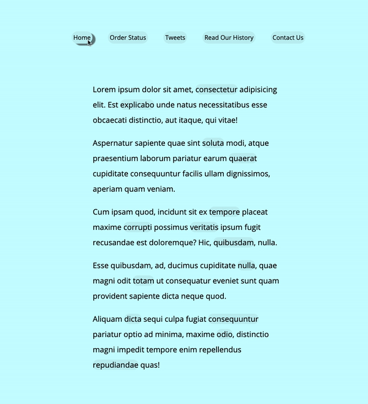

# 22. Follow Along Link

#### _Follow Along Link by JavaScript30 10/24/19_

## Description
This is Follow Along Link, 22nd application out of 30 by 30 day Vanilla JavaScript Coding Challenge by Wes Bos.<br>
Please check the challenge from [JavaScript30](http://wesbos.com/javascript30/).




## About this Application
- When a user hover over the `a` tag in the page, the shadow will follow.

- Get each `a` tag's coordinates from `getBoundingClientRect()` API.

- Each `a` tags listens `mouseenter` event.

## Setup/Installation

1. Clone this repo:
```
$ git clone https://github.com/misakimichy/JS30-22-follow-along-link.git
```

2. Navigate to the top level of the cloned directory.

3. Open index.html with your preferred web browser.

## Known Bugs
* No known bugs at this time.

## Support and contact details
 I welcome any feedbacks and comments: misaki.koonce@gmail.com

## Technologies Used
_Git, GitHub, HTML, CSS, Vanilla JavaScript

## License
Copyright © 2019 under the MIT License